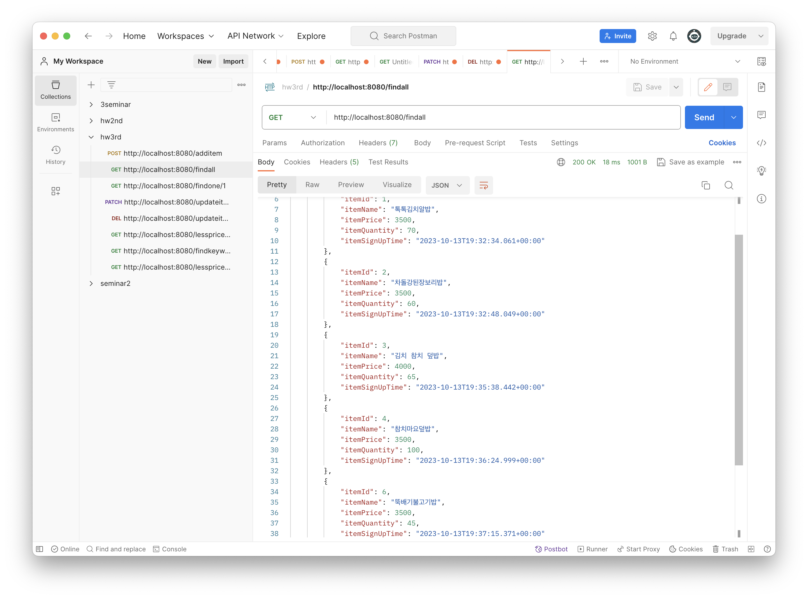

# 3rd homework
+ mysql 연결
+ jpa 구문 만들기

 

## 1️⃣ 물품 추가

## 2️⃣ 리스트 출력 (전체, 해당 ID)
### 2-1 전체

### 2-2 해당 ID

## 3️⃣ 물품 수정

* 수정 후 확인

## 4️⃣ 물품 삭제

* 삭제 후 확인

## 5️⃣ jpa 구문
* 입력 가격보다 낮은 item 출력

* 입력 수량보다 낮은 item 출력

* 해당 키워드 포함한 item 출력

* min, max 가격 사이에 있는 item 출력

---
