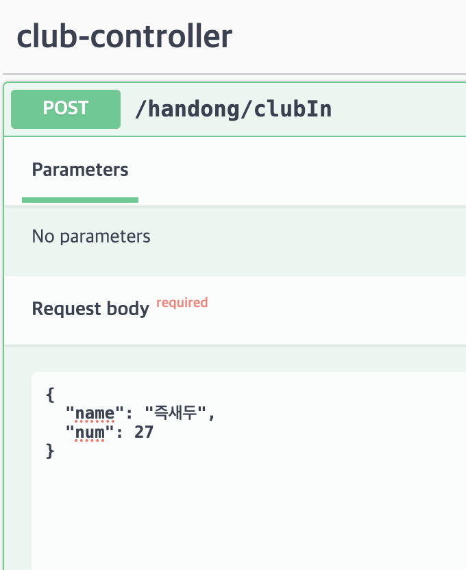
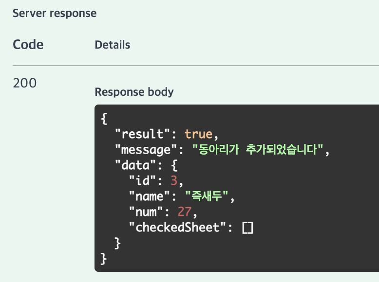
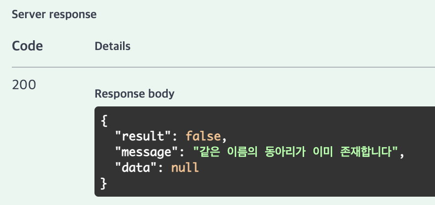
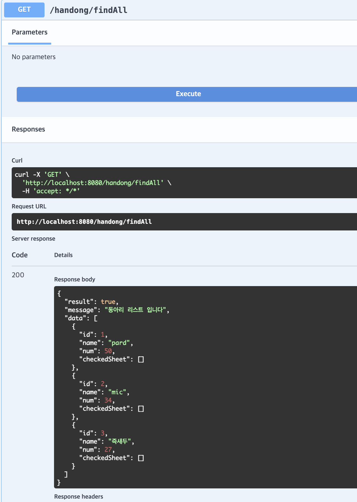
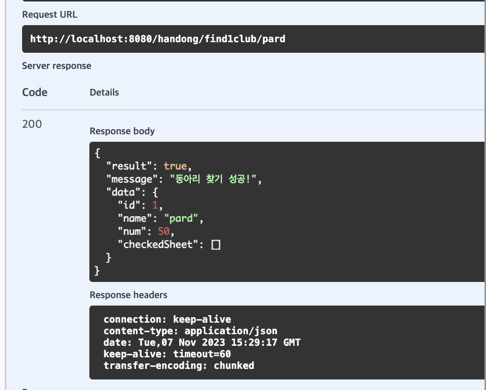
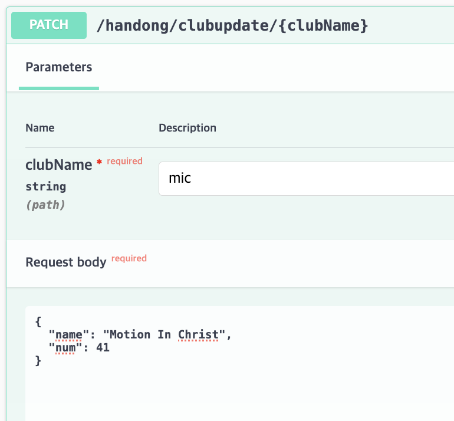
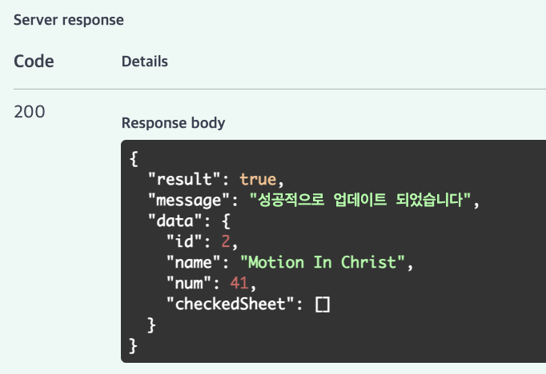
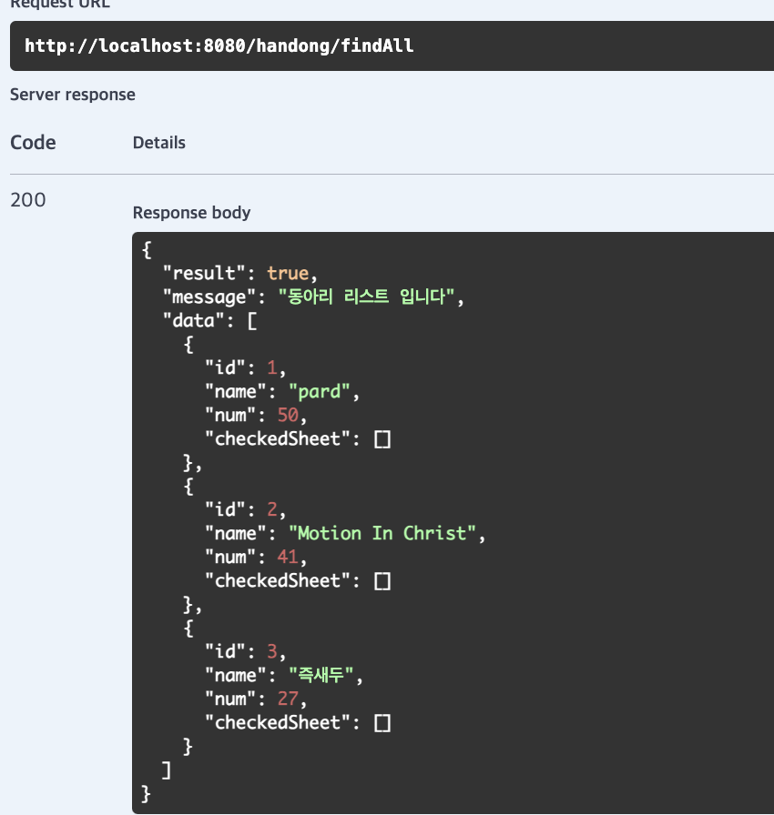
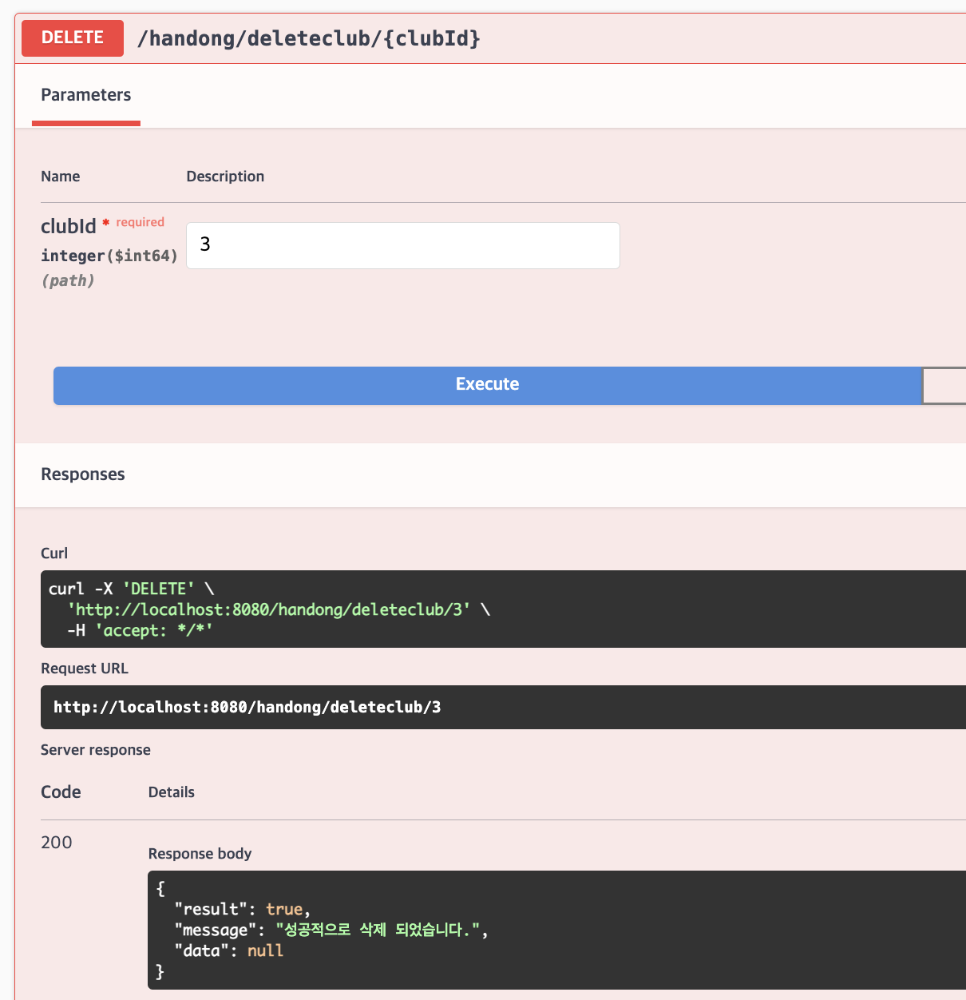
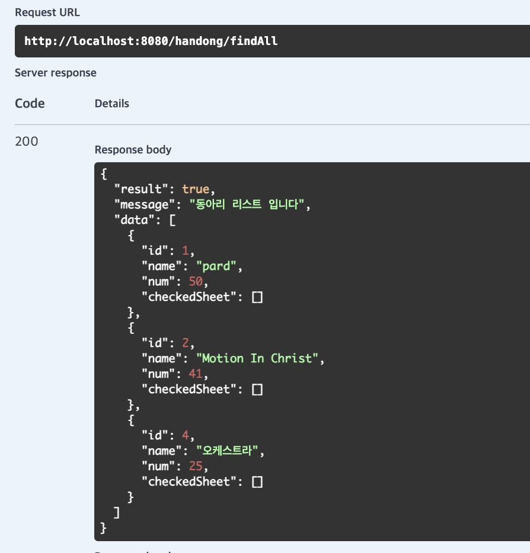

# 5th homework
+ 나만의 주제 정하기: 한동대 동아리 시트 잡기
+ 전체적인 프로그램 작성: 디비 연결, crud 등

 

# club-controller
## 1️⃣ 동아리 추가
### 정상적인 추가

### 같은 이름의 동아리 추가

## 2️⃣ 동아리 리스트 출력 (전체, 해당 ID)
### 2-1 전체

### 2-2 동아리 이름으로 찾기

## 3️⃣ 동아리 정보 수정

* 수정 후 확인

## 4️⃣ 동아리 정보 삭제

* 삭제 후 확인

## 5️⃣ jpa 구문
---
# sheet-controller
## 1️⃣ 시트 추가
### 정상적인 추가

### 같은 시간, 장소, 날짜의 시트 추가

## 2️⃣ 시트 리스트 출력 (전체, 해당 장소)
### 2-1 전체

### 2-2 시트 장소로 찾기

## 3️⃣ 시트 정보 수정

* 수정 후 확인

## 4️⃣ 시트 삭제

* 삭제 후 확인

